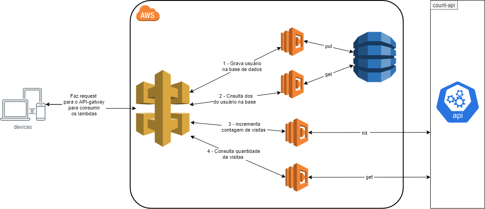

# Desafio TON #

1. Criar uma rota para incrementar o número de acessos;

2. Criar uma rota para consultar o número de acessos;

3. Criar uma rota para criar um usuário;

4. Criar uma rota para visualizar as informações de um usuário.

### Descrição ###

O projeto ton-api é implementação do desafio proposto para o cargo de engenheiro senior. O projeto, incrementa e consulta a quantidade de visitas

ao site ton.com.br, também permite gravar e consultar os dados de um usuário em uma base de dados (dynamoBD).

Para implementar o desafio, foi utilizada a arquitetura Serverless (API Gateway + Lambda + DynamoDB), os testes uniários forma escritos usando a lib jest.

Para salvar as informações do usuário deverá feito uma requisição POST para o endpoint (https://w2ztf6opoc.execute-api.us-east-1.amazonaws.com/dev/user)

```json
{
  "cpf": "00000000000",
  "nome": "Afranio rodrigues",
  "email": "afranio@email.com",
  "idade": 105,
  "login": "afranio",
  "password": "xpto"
}
```

Caso o usuário tenha sido cadastrado com sucesso, será retornado o código rest 201.

Caso, esteja tentando cadastrar um usuário, onde o mesmo já tenha sido cadastrado anteriormente, será retornado uma mensagem o seguinte formato:

```json
{
   "message": "Já existe um usuário cadastrado com o CPF informado."
}
```

A API também permite, consultar os dados de um usuário, usando como chave o CPF somente com os números. Para solicitar os dados de um determinado usuário, deverá ser feito uma request GET para o endpoint (https://w2ztf6opoc.execute-api.us-east-1.amazonaws.com/dev/user-data/{cpf}).

Caso exista algum registro para o CPF informado, será retornado um registro com os dados recuperado do banco de dados, abaixo segue o exemplo de um valor retornado:

```json
{
  "cpf": "00000000000",
  "nome": "Afranio rodrigues",
  "email": "afranio@email.com",
  "idade": 105,
  "login": "afranio",
  "dataCadastro": "2021-04-02T23:30:43+00:00"
}
```
 Caso seja informado um CPF que não esteja cadastrado na base de dados, será retornado uma resposta com o status http 404, abaixo segue o exemplo da resposta:
 
 ```json
{
    "message": "Não existe nenhum registro para o CPF informado."
}
```

A API também, permite incrementar e consultar a quantidade de visitas ao site ton.com.br. 

Para incrementar a quantidade de visitas ao site ton.com.br, deverá ser feito uma requisição POST para o endpoint (https://w2ztf6opoc.execute-api.us-east-1.amazonaws.com/dev/count-visits).

Caso tenha sido incrementado com sucesso, será retornado uma resposta com o código http 200.

Para consulta a quantidade de visitas ao site ton.com.br, deverá ser feito uma requisição GET para o endpoint (https://w2ztf6opoc.execute-api.us-east-1.amazonaws.com/dev/count-visits).

Caso a requisição tenha sido processado com sucesso, será retornado um payload como descrito abaixo:

 ```json
{
  "count":47
}
```

### Arquitetura ###

A arquitetura para utilização deste serviço foi definida conforme a figura abaixo:



### Base de Dados ###

O armazenamento dos dados do usuário foi foito no banco de dados dynamoDB. Foi utilizada a coluna cpf, como sendo a chave primaria no dynamoDB, logo para consultar os dados

de um usuário, deverá ser utilizado o cpf do usuário. A senha do usuário é armazenada no banco no formato de um hash MD5.

